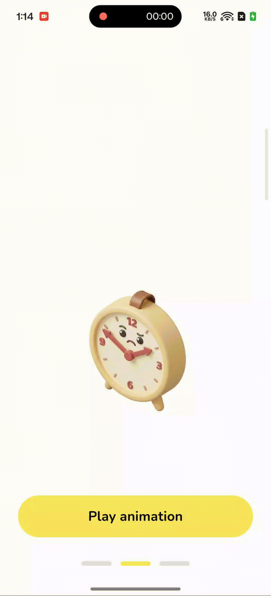

# Haptic Typewriter Text

A Flutter widget that creates a typewriter animation effect with synchronized haptic feedback for every character typed. This provides a tactile and engaging user experience for displaying text.



## Features

- **Typewriter Effect**: smooth character-by-character text reveal.
- **Haptic Feedback**: `HapticFeedback.selectionClick()` is triggered on each character appearance.
- **Controller-Driven**: specific control over when to start typing or reset the text using `HapticTypewriterController`.
- **Customizable**: control typing speed and text styling.

## Usage

1.  **Initialize the Controller**:
    Create an instance of `HapticTypewriterController` in your widget state.

    ```dart
    final HapticTypewriterController _controller = HapticTypewriterController();
    ```

2.  **Add the Widget**:
    Place `HapticTypewriterText` in your widget tree.

    ```dart
    HapticTypewriterText(
      controller: _controller,
      style: TextStyle(
        fontSize: 24,
        fontWeight: FontWeight.bold,
      ),
      speed: Duration(milliseconds: 50), // Optional: default is 100ms
      onComplete: () {
        print("Typing completed!");
      },
    )
    ```

3.  **Trigger Typing**:
    Call the `type` method on the controller to start the animation.

    ```dart
    _controller.type("Hello, Haptic World!");
    ```

4.  **Reset**:
    You can clear the text using the `reset` method.

    ```dart
    _controller.reset();
    ```

## Example

```dart
import 'package:flutter/material.dart';
import 'package:haptic_typewriter_text_example/widgets/haptic_typewriter_text.dart';

class MyPage extends StatefulWidget {
  @override
  _MyPageState createState() => _MyPageState();
}

class _MyPageState extends State<MyPage> {
  final HapticTypewriterController _controller = HapticTypewriterController();

  @override
  Widget build(BuildContext context) {
    return Scaffold(
      body: Center(
        child: Column(
          mainAxisAlignment: MainAxisAlignment.center,
          children: [
            HapticTypewriterText(
              controller: _controller,
              style: TextStyle(fontSize: 30),
            ),
            SizedBox(height: 20),
            ElevatedButton(
              onPressed: () {
                _controller.type("This is a haptic typewriter effect.");
              },
              child: Text("Type Text"),
            ),
          ],
        ),
      ),
    );
  }
}
```
